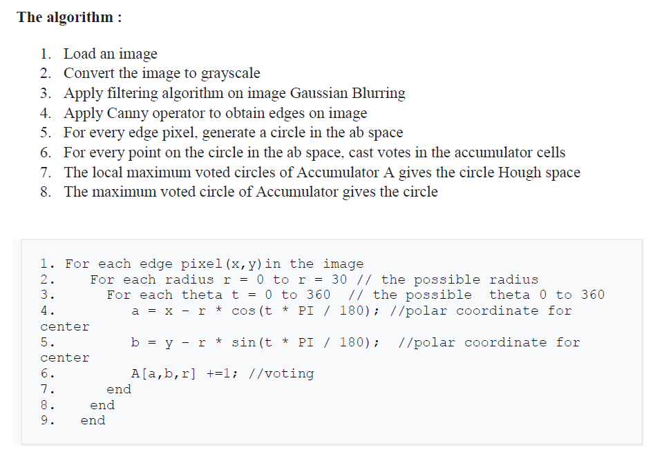
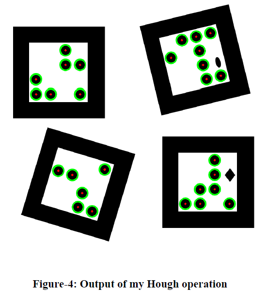
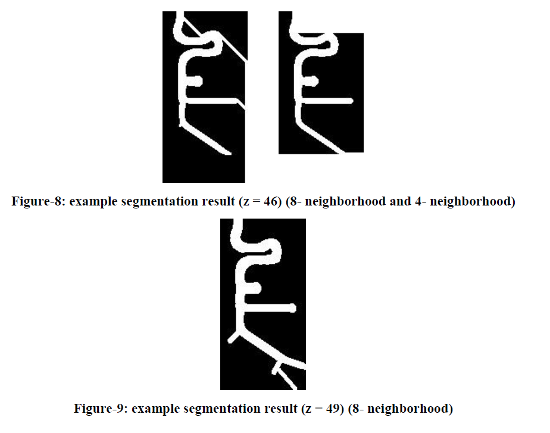

<b>Note:</b> If you want to learn more information about this study, you can read report or study explanation documents.

<h4>Part1</h4>
Hough Circle Detection - Problem Construction
The algorithm pseudo-code to detect circles is given below:

<h4>Part2</h4>
By using the algorithm which is given in part1, circles are detected from the given image.

<h4>Part3</h4>
Region growing algorithm using different parameters and approaches is implemented. Intensity difference is used as the growing criteria. 8-neighborhood and 4-neighborhood methods are used.

