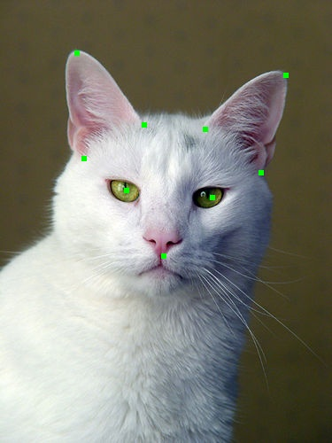
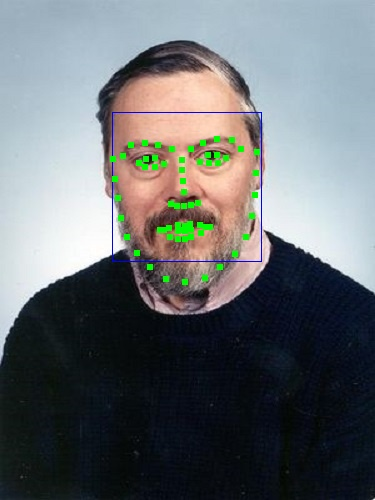
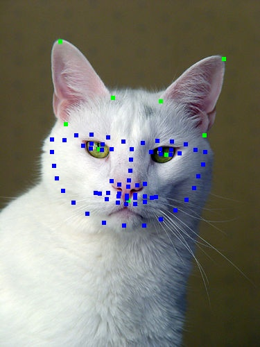
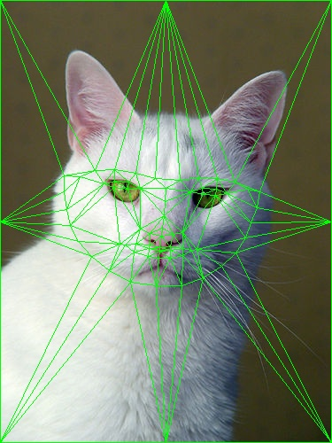
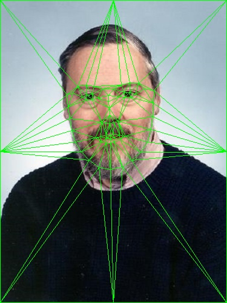

<b> Note: </b> If you want to learn more information about this study, you can read report or study explanation documents.
 

In this study, face landmark, face triangulation and face morphing operations are implemented. The outputs of the parts are given below:

<h4>Part 1</h4>
Show landmark points

<h4>Part 2</h4>
Show facial landmarks on cat image

  
<h4>Part 2</h4>
Show facial landmarks on cat image

<h4>Part 3</h4>
Show delaunay triangles for the found landmarks

<h4>Part 4</h4>
Do a triangle animation in 20 steps with changing color

<h4>Part 5</h4>
Face morphing implementation using the techniques from previous parts

