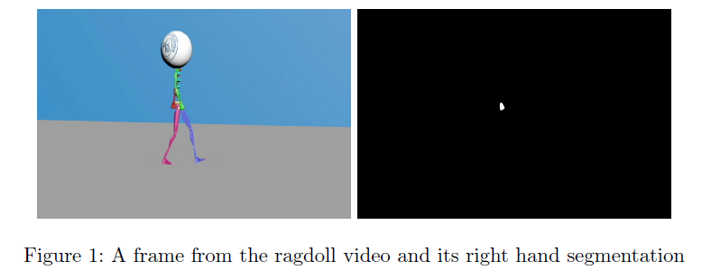
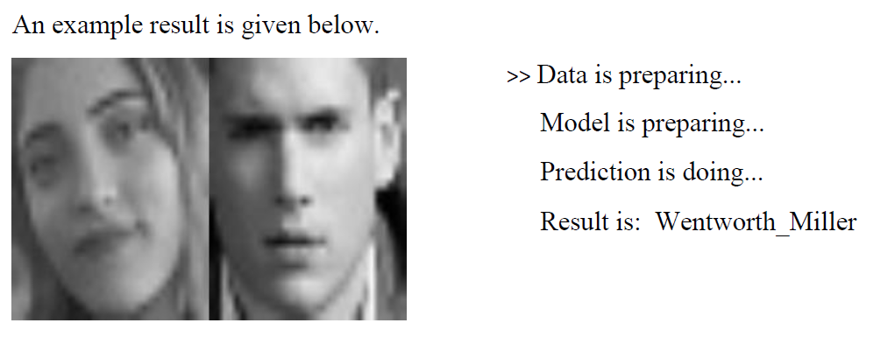

<b> Note: </b> If you want to learn more information about this study, you can read report or study explanation documents.
 

<h4>Part 1</h4>

Lucas-Kanade algorithm is implemented locally to find the OF vector of the hand (to track the right hand of the creature from the video).

You can find the results in Outputs folder.

<h4>Part 2</h4>

10-nearest neighbors classification inside the projected space is used to find the celebrities who are most similar to you.

