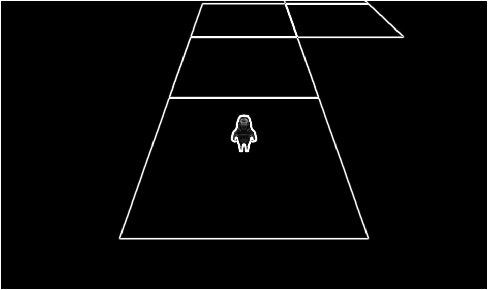
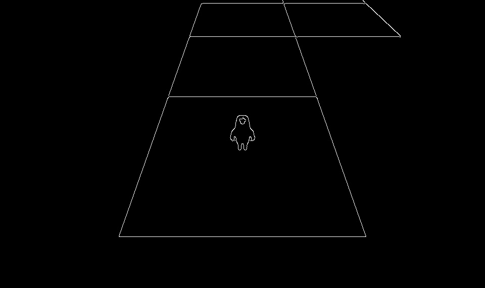
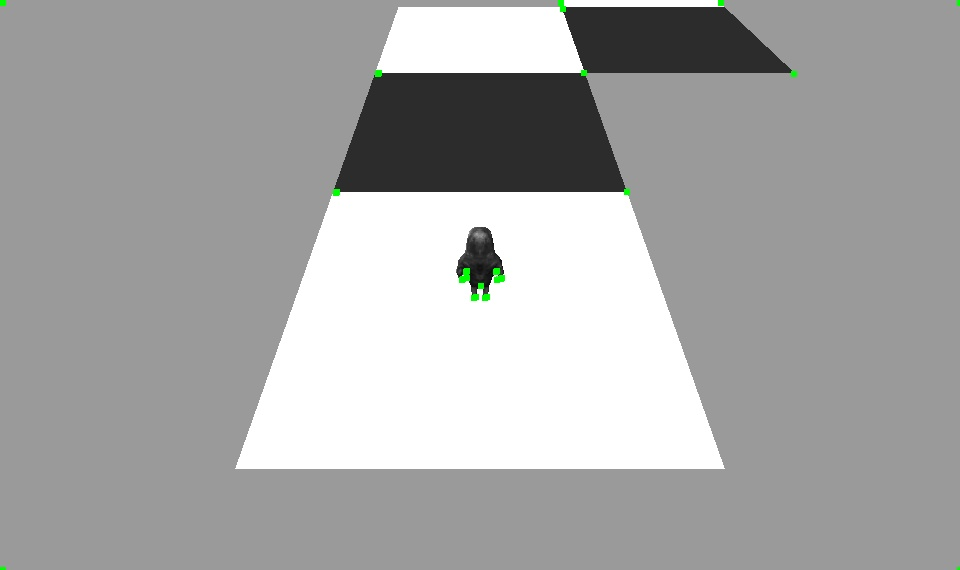
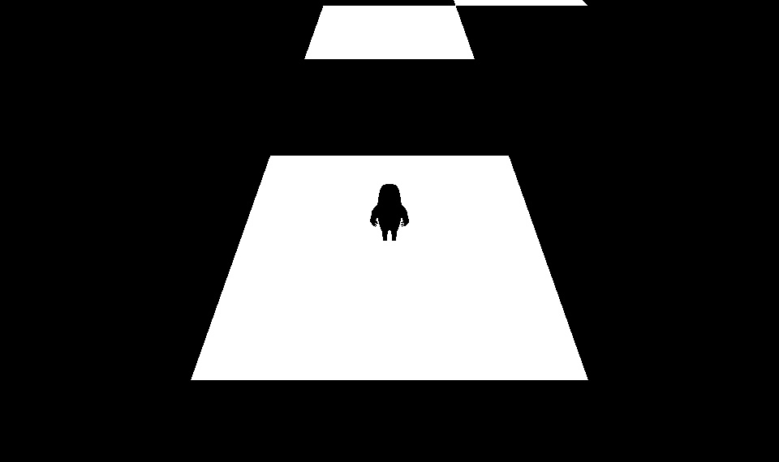

<b>Note:</b> If you want to learn more information about this study, you can read report or study explanation documents.

<h4>Part1</h4>
Sobel Filter

<h4>Part2</h4>
Canny Edge Detector

<h4>Part3</h4>
Minimum Eigenvalue Corner Detector

<h4>Part5</h4>
Otsu Thresholding

 

You can find the videos (outputs of the study) in the link below:
https://drive.google.com/open?id=1UpIehatrLbnbzBiGog392I5Zcn-MwDh4
